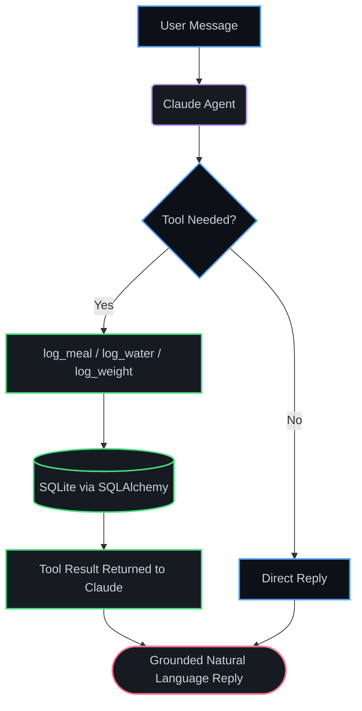

<div align="center">

# Welcome to My Digital Space

[](https://raw.githubusercontent.com/amoghvijay/amoghvijay/main/tech-stack.svg)

[](https://git.io/typing-svg)

<a href="https://www.linkedin.com/in/amogh-vijay-151164333" target="_blank"></a>
<a href="mailto:amoghvijay07@gmail.com"></a>
<a href="https://github.com/amoghvijay" target="_blank"></a>


</div>

---

## 🙋‍♂️ About Me

<table>
<tr>
<td width="60%">

Hey there! I'm a passionate 3rd-year B.Tech CSE (AI) student who loves building AI-powered applications and automating real workflows — not just toy demos.

```javascript
const amogh = {
    location:   "Jaipur, Rajasthan, India",
    education:  "B.Tech CSE – Artificial Intelligence | 3rd Year",
    role:       "Agentic AI Developer",
    philosophy: "Build it once, automate it forever.",

    currently: {
        building:  ["AI Agents with Tool-Calling", "Full Stack AI Apps"],
        learning:  ["Machine Learning", "Deep Learning", "Generative AI"],
        exploring: ["Agentic AI Workflows", "Prompt Engineering"]
    }
};
```

</td>
<td width="40%" align="center">


</td>
</tr>
</table>

---

## 🤖 Agentic AI Workflow Architecture

Here's how I structure a Claude-powered agent that acts on real user data (like in NutriMate AI):



---

## 🛠️ Tech Stack

### 🔙 Backend Development
    

### 🎨 Frontend Development
   

### 💻 Core Languages
  

### 🤖 AI Toolkit — "What I Build With"
*"I don't just chat with these — I wire them into agents and full pipelines."*

  

### 🚀 Tools & Version Control
  

---

## 🚀 Featured Projects

### 🎬 [CineBot — AI Movie Recommendation Chatbot](https://github.com/amoghvijay/Cinebot-movie-suggestion-ai)

<table>
<tr>
<td width="55%">

| Metric / Feature | Detail |
|---|---|
| 🧠 **AI-Powered** | 4 tailored movie picks via Google Gemini |
| 🖼️ **Rich Cards** | Live posters, ratings & overviews from TMDB |
| 💬 **Interface** | Guided quick-replies + free-text chat |
| 🔁 **Reliability** | Auto-retry logic for API hiccups |
| 🛠️ **Tech Stack** | Python, Flask, Gemini API, TMDB API |

</td>
<td width="45%">

[](https://github.com/amoghvijay/Cinebot-movie-suggestion-ai)

</td>
</tr>
</table>

### 🥗 [NutriMate AI — Personal Nutrition Agent](https://github.com/amoghvijay/Nutrimate-ai)

<table>
<tr>
<td width="55%">

| Metric / Feature | Detail |
|---|---|
| 🤖 **Action Agent** | Claude tool-calling logs meals from plain chat |
| 🧬 **Calculator** | BMI, BMR, TDEE & macros (Mifflin-St Jeor) |
| 📈 **Charts** | Live macro breakdown + weight trend |
| 🔐 **Auth** | Bcrypt-hashed passwords, session tokens |
| 🛠️ **Tech Stack** | FastAPI, SQLAlchemy, SQLite, Claude API |

</td>
<td width="45%">

[](https://github.com/amoghvijay/Nutrimate-ai)

</td>
</tr>
</table>

### 📄 [ResumeForge AI — Resume Analysis & Job Matching](https://github.com/amoghvijay/Resume-Forge-AI)

| Metric / Feature | Detail |
|---|---|
| 📤 **Parsing** | Extracts skills, experience & education from resumes |
| 🤖 **AI Agent** | Scores resume content against job listings |
| 🔍 **Job Fetching** | Pulls relevant listings for matching |
| 🛠️ **Tech Stack** | Python, FastAPI, SQLite |

### ☕ [Java Programs & Projects — Core Java Lab](https://github.com/amoghvijay/Java-Programs-and-Projects)

| Metric / Feature | Detail |
|---|---|
| 🧵 **Multithreading** | Thread, Runnable, sleep(), join(), sync |
| 📁 **File Handling** | Create, read, write, append, metadata |
| 🔤 **Strings** | String, StringBuffer, StringBuilder, palindrome |
| 🛠️ **Tech Stack** | Core Java |

---

## 📊 GitHub Statistics

<div align="center">

[](https://github.com/amoghvijay)

[](https://github.com/amoghvijay) [](https://github.com/amoghvijay)

[](https://github.com/amoghvijay)

[](https://github.com/amoghvijay)

[](https://github.com/amoghvijay)

</div>

---

## 🎯 Current Focus & Learning

```python
class CurrentFocus:
    building = [
        "AI Agents with Tool-Calling",
        "Full Stack AI-Powered Apps",
    ]
    learning = [
        "Machine Learning",
        "Deep Learning",
        "Generative AI",
    ]
    improving = [
        "Agentic Workflow Design",
        "Prompt Engineering",
        "System Design for AI Apps",
    ]
```

---

<div align="center">

*"If it's repetitive, automate it. If it's complex, agent-ify it."*
**— Amogh Vijay**

</div>
